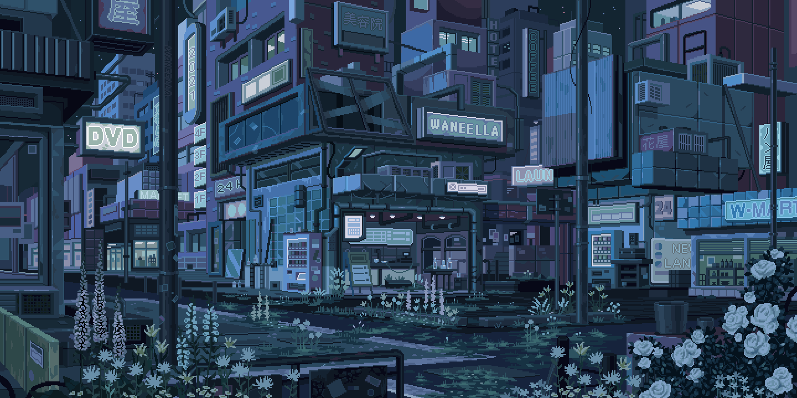
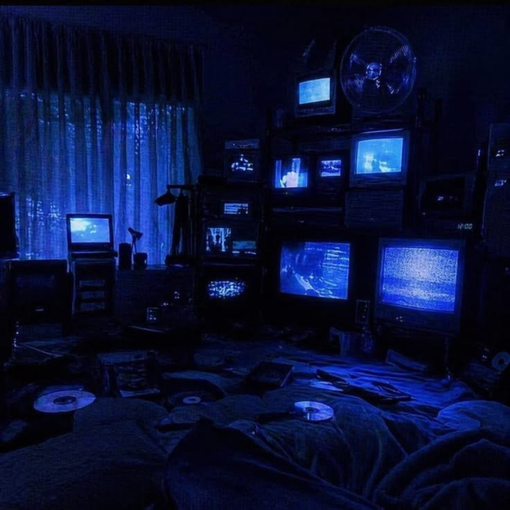

<!-- ======================= BANNER ======================= -->

<p align="center">
  
</p>

# hi, i'm ava 🎀

<p align="center">

[](https://git.io/typing-svg)

</p>

<p align="center">

teen girl making cool internet things at 1am 💀

building cozy interfaces • surviving backend bugs • collecting npm errors like Pokémon 🎀

</p>

---

# 📊 github chaos

<p align="center">


</p>

---

# 🌌 aesthetic corner

<p align="center">



</p>

---

# 💻 tech stack

<p align="center">


</p>

---

# ✨ about me

```js
const ava = {

    age: 13,

    location: "Earth (probably)",

    role: "Full-stack developer",

    currentlyLearning: [
        "Next.js",
        "Tailwind CSS",
        "Git",
        "Python"
    ],

    loves: [
        "Aesthetic UI",
        "Frontend",
        "Music",
        "Dark themes",
        "Pixel art"
    ],

    fears: [
        "CSS randomly breaking",
        "npm",
        "merge conflicts",
        "centering divs"
    ],

    currentlyDoing:
        "Turning emotionally unstable thoughts into responsive layouts 🎀"
}
```

---

# 🎀 currently obsessed with


---

# 💀 coding wisdom

> coding is basically drawing.

> except the line isn't straight.

> so i spend another hour decorating the mistake with flowers, animations and fancy UI until nobody notices.

---

> if the frontend looks pretty enough maybe nobody notices the backend crying 💀

---

> turning emotional instability into responsive design since 2026

---

# 🚀 currently building

🎵 MusicPlayer

A cinematic music player made with Next.js.

Trying to make listening to music feel like entering a movie.

---

🌐 Learning GitHub properly

Trying not to accidentally destroy repositories.

---

🎀 More aesthetic websites.

Because plain websites hurt my soul.

---

# 🌙 dream projects

✨ futuristic websites

🎧 music interfaces

🌌 hacker girl dashboards

🎮 emotional pixel games

📱 social apps

🩵 internet experiments

---

# 🎵 coding soundtrack

Billie Eilish

Olivia Rodrigo

FINNEAS

The Neighbourhood

Sombr

```txt
currently coding in:

dark mode

questionable life decisions

late-night motivation

✨
```

---

# 🐍 contribution snake

<p align="center">


</p>

---

<p align="center">

made with 💙, music and an unreasonable emotional attachment to UI

</p>
