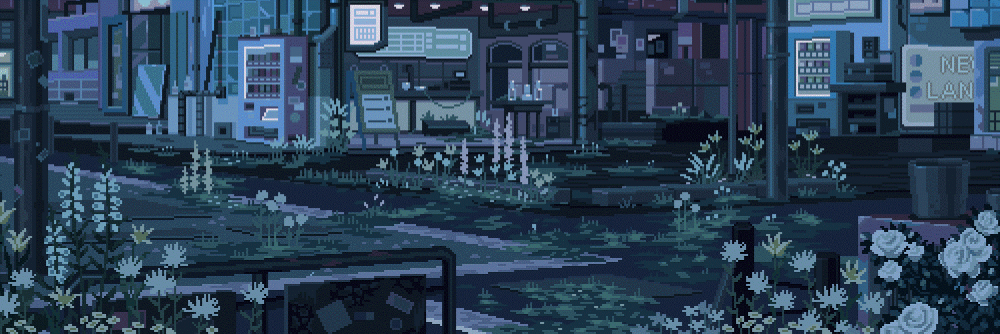

<!-- ======================= BANNER ======================= -->

<p align="center">
  
</p>

<h1 align="center">hi, i'm ava 🎀</h1>

<p align="center">

[](https://git.io/typing-svg)

</p>

<p align="center">

teen girl building cozy internet things one commit at a time ✨

frontend lover • backend survivor • powered by music, caffeine and unreasonable emotional attachment to UI

</p>

<br>

# 📊 GitHub Activity

<p align="center">


</p>

<br>

# 🌌 My Coding Universe

<p align="center">


</p>

<p align="center">

late-night playlists • blue lights • too many open VS Code tabs • pretending npm errors aren't personal

</p>

<br>

# 💻 Toolbox

<p align="center">


</p>

<br>

# ✨ About Me

```javascript
const ava = {
  nickname: "Ava",

  role: "Full-Stack Developer",

  currentlyLearning: [
    "Next.js",
    "Tailwind CSS",
    "Git",
    "Python"
  ],

  enjoys: [
    "Beautiful UI",
    "Frontend",
    "Music",
    "Dark themes",
    "Making websites feel alive",
    "Pixel aesthetics"
  ],

  currentlyBuilding: [
    "🎵 MusicPlayer",
    "Random web experiments",
    "My GitHub profile",
    "Future open-source projects"
  ],

  funFact() {
    return "Started coding in Windows Notepad before discovering VS Code 💀";
  }
}
```

<br>

# 🚀 Featured Project

### 🎵 MusicPlayer

A cinematic music player built with **Next.js**.

The goal isn't just playing music—

it's making music feel like entering a movie.

> currently under construction... and probably breaking something every day.

<br>

# 🎀 Currently Exploring

<p>

🩵 Next.js

🌊 Tailwind CSS

🐙 Git & GitHub

⚡ Better React patterns

🎨 UI animations

🌙 Desktop-inspired interfaces

</p>

<br>

# 💀 Coding Wisdom

> Coding is basically drawing...
>
> except the line is never straight,
>
> so I spend another hour decorating the mistake with animations, gradients and fancy UI until nobody notices.

<br>

> If the frontend looks beautiful enough,
>
> maybe nobody notices the backend crying.

<br>

> Every bug eventually becomes
>
> "wait... why did THAT fix it?"

<br>

# 🌙 Dream Projects

✨ Futuristic websites

🎵 Beautiful music players

🎮 Emotional pixel games where literally everything is alive

💻 Cozy desktop applications

📱 Social platforms

🌌 Hacker-girl inspired interfaces

🩵 Weird little internet experiments

<br>

# 🎧 Currently Playing

```txt
🎵 Billie Eilish
🎵 Olivia Rodrigo
🎵 FINNEAS
🎵 The Neighbourhood
🎵 Sombr

──────────────

coding environment

✓ dark mode

✓ late-night motivation

✓ at least one npm error

✓ somehow still having fun
```

<br>

# 🌱 2026 Goals

- Build more polished full-stack projects
- Contribute to open source
- Learn Electron
- Create beautiful desktop apps
- Stop being scared of backend
- Collect GitHub achievements 🏆

<br>

# 🐍 Contribution Snake

<p align="center">


</p>

<br>

# 💌 Let's Connect

<p align="center">

If you also enjoy building aesthetic websites, cozy interfaces or random internet experiments...

you're awesome already ✨

</p>

---

<p align="center">

made with 💙

billie playing in the background

and at least one npm error.

</p>