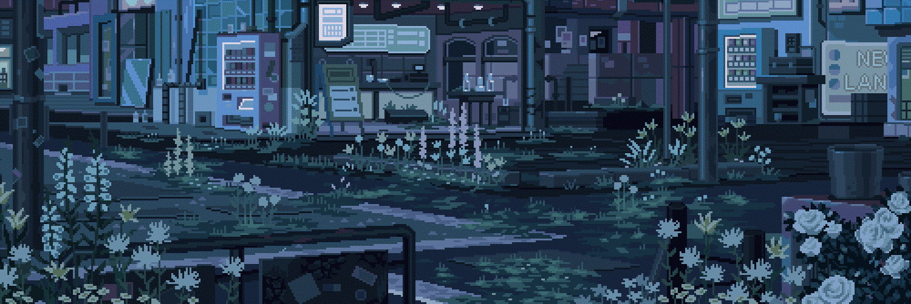
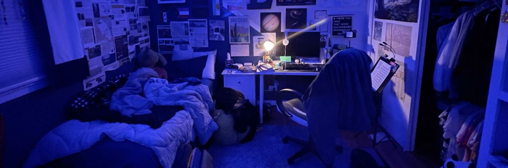

<!-- ======================= BANNER ======================= -->

<p align="center">
  
</p>

<h1 align="center">hi, i'm ava 🎀</h1>

<p align="center">

[](https://git.io/typing-svg)

</p>

<p align="center">
  building cozy little corners of the internet, one commit at a time ✨<br>
  frontend lover • powered by music and unreasonable emotional attachment to UI
</p>

---

## 🌌 My Coding Universe

<p align="center">
  
</p>

<p align="center">
  late-night playlists • blue lights • too many open VS Code tabs • pretending npm errors aren't personal
</p>

---

## 🚀 Featured Project

### 🎵 MusicPlayer

*A cinematic music player built with Next.js.*

**Next.js • React • Tailwind CSS**

✨ Animated album art  
🎵 Playlist support  
💙 Modern, immersive UI  

> currently under construction — and discovering new ways to break it every day.

<br>

---

<br>

## 💻 Toolbox

<p align="center">
  
</p>

---

## ✨ About Me

```javascript
const ava = {
  nickname: "Ava",
  role: "Full-Stack Developer",
  
  currentlyLearning: [
    "Backend architecture",
    "TypeScript",
    "Animation techniques",
    "Open-source workflows"
  ],
  
  enjoys: [
    "Beautiful UI",
    "Frontend",
    "Music",
    "Dark themes",
    "Making websites feel alive"
  ],
  
  funFact: "Started coding in Windows Notepad before discovering VS Code 💀"
}
```


---


## 💀 Coding Wisdom

> Coding is basically drawing...
> 
> except the line is never straight,
> 
> so I spend another hour decorating the mistake with animations, gradients, and fancy UI until nobody notices.


---


## 🌙 Dream Projects

- ✨ Futuristic websites
- 🎵 Beautiful music players
- 🎮 Emotional pixel games
- 💻 Cozy desktop applications
- 🌌 Desktop-inspired interfaces
- 🩵 Weird little internet experiments


---

## 🎧 Currently Playing

```txt
🎵 Billie Eilish
🎵 Olivia Rodrigo  
🎵 FINNEAS
🎵 The Neighbourhood

──────────────

coding environment
✓ dark mode
✓ late-night motivation
✓ at least one npm error
✓ somehow still having fun
```


---


## 🌱 2026 Goals

- Build polished full-stack projects
- Contribute to open source
- Learn Electron
- Create beautiful desktop apps
- Collect GitHub achievements 🏆


---

<p align="center">
  made with 💙<br>
  and at least one npm error
</p>
