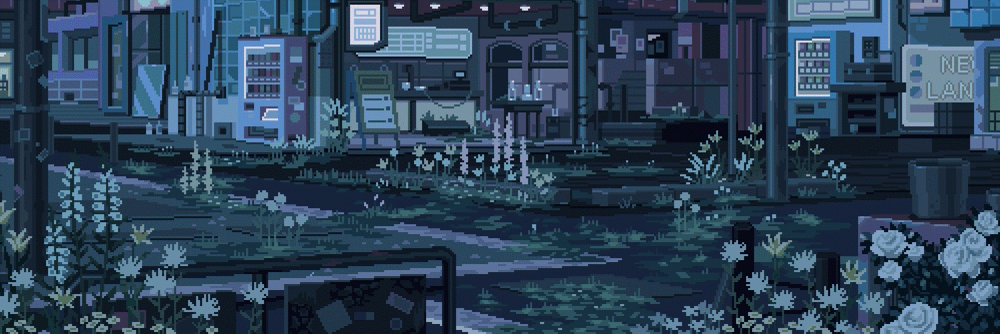

  

<h1 align="center">Hey, I'm Ava</h1>

  <strong>I build things, break things, fix them, and ship the result.</strong>

  <a href="https://github.com/Ava-91?tab=repositories">Projects</a> ·
  <a href="https://cozyfolio.vercel.app/">Portfolio</a> ·
  <a href="https://github.com/Ava-91">GitHub</a>

---

## 👋 About me

I'm a developer who likes turning random ideas into **actual software**.

I mostly work with **TypeScript, React, Next.js, and Python**, while also experimenting with desktop apps, audio, automation, CLI tools, themes, and the occasional idea that probably did not need its own repository.

I learn by building:

> **Idea → prototype → break it → fix it → ship it**

I'm especially interested in the space between **good engineering and a good experience** — software that works well and is enjoyable to use.

## 🚀 Selected projects

These are the projects I actually want people to see first — not every experiment I've ever pushed to GitHub.

### 🎨 [VibeSorter](https://github.com/Ava-91/VibeSorter)
A local-first image organizer that sorts photos by **visual aesthetics, colors, moods, and vibes**, with image analysis and a local database.

**Python · Pillow · SQLite · Image Analysis**

### 📸 [RepoShot](https://github.com/Ava-91/reposhot)
A tool for generating **customizable GitHub repository preview cards** with multiple themes and layouts.

**Next.js · React · TypeScript · Tailwind CSS**

→ [Live demo](https://reposhot.vercel.app/)

### 🎙️ [Ovrino](https://github.com/Ava-91/ovrino)
A voice-focused **text-to-speech mobile app** built with React Native and Expo.

**TypeScript · React Native · Expo · TTS**

### 🎵 [Luna](https://github.com/Ava-91/luna)
A desktop music library manager for **cleaning, organizing, and fixing local music collections**.

**Python · Desktop · Music Libraries · File Operations**

### 🌙 [Harmelune](https://github.com/Ava-91/harmelune)
A metadata-aware music library synchronization tool for Windows with **matching, backups, conflict review, and dry-run support**.

**Python · Windows · Metadata · File Synchronization**

### 🌿 [Verdea](https://github.com/Ava-91/verdea)
A modern responsive plant shop built with **Next.js and TypeScript**, focused on frontend UI and interaction.

**Next.js · TypeScript · React · UI**

### 🌌 [Ava Night](https://github.com/Ava-91/ava-night)
A dark VS Code theme designed around **readability, balanced contrast, and comfortable long coding sessions**.

**VS Code · Theme Design · JSON**

### 🎧 [MusicPlayer](https://github.com/Ava-91/MusicPlayer)
A web music player built with **Next.js and Tailwind CSS**.

**Next.js · React · Tailwind CSS**

### 🧸 [Cozyfolio](https://github.com/Ava-91/cozyfolio)
My personal portfolio and a playground for **web design, animation, and interaction**.

→ [Visit the site](https://cozyfolio.vercel.app/)

### 🧪 [Musivex](https://github.com/Ava-91/Musivex) · archived
An earlier experiment in **music metadata enrichment and transformation-aware song recognition**.

**Python · Music Metadata · Audio**

## 🛠️ Stack

**Frontend**  
\`TypeScript\` · \`React\` · \`Next.js\` · \`Tailwind CSS\` · \`HTML\` · \`CSS\`

**Backend & scripting**  
\`Python\` · \`Node.js\` · \`PHP\`

**Tools**  
\`Git\` · \`GitHub\` · \`VS Code\` · \`Vercel\`

**Currently exploring**  
\`Testing\` · \`CI/CD\` · \`Desktop development\` · \`APIs\` · \`Performance\` · \`Architecture\`

## 📊 August 2026

I apparently had a productive month:

- **590 commits**
- **16 repositories**
- **146 issues opened**
- **7 repositories created**
- **120 commits in one day**

Yes, most of those projects are actual projects. 😭

> \`git status\`  
> **still working**

## 🌱 What I'm learning

I'm less interested in collecting technologies and more interested in getting better at **building complete software**.

Right now:

- Writing better tests
- Designing cleaner architectures
- Building better CLI and developer tools
- Improving accessibility and UX
- Making projects faster and more reliable
- Taking projects from **“it works”** to **“this is actually finished”**

## 💭 How I work

> **Build it. Break it. Figure out why. Make it better.**

I learn best by building, finding what I did wrong, fixing it, and gradually turning a rough idea into something useful.

💀 Project graveyard

Not every idea survives.

Some projects become useful tools.  
Some become experiments.  
Some work once and are never touched again.

They all count as part of the process.

## 🐍 Contribution snake

  

---

### 🚀 Explore my work

  Built with curiosity, too many tabs, and probably one more UI tweak.

